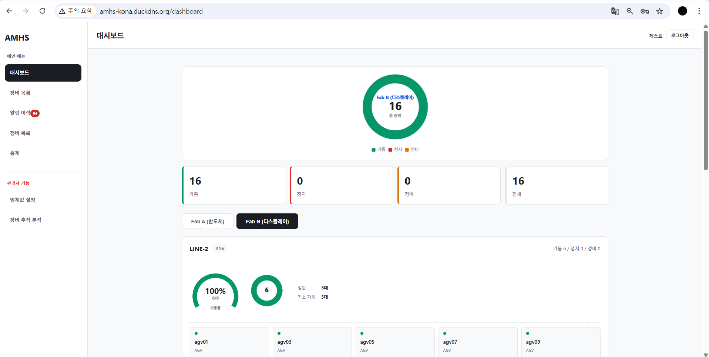
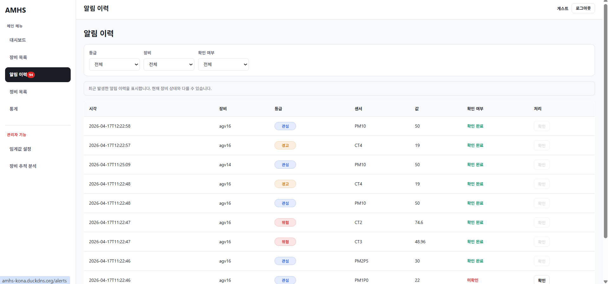

# AMHS Frontend

반도체/스마트팩토리 환경의 **AMHS(Automated Material Handling System)** 모니터링 및 관리용 프론트엔드 프로젝트입니다.  
장비 현황, 알림 이력, 정비 관리, 통계 분석, 임계값 설정 등의 기능을 웹 기반 UI로 제공합니다.

---

## 1. 프로젝트 개요

본 프로젝트는 스마트팩토리 환경에서 사용되는 **OHT, AGV 등 물류 장비의 상태를 시각화하고 관리**하기 위한 프론트엔드 시스템입니다.

주요 목표는 다음과 같습니다.

- 장비 상태 및 운영 현황을 한눈에 확인할 수 있는 대시보드 제공
- 장비 목록, 상세 정보, 센서 데이터 이력 확인
- 알림 발생 이력 및 미확인 알림 관리
- 정비 오더 조회, 상세 확인, 생성 및 상태 전이 지원
- 위험도 통계 및 추적 분석 시각화
- 관리자용 임계값 설정 및 분석 페이지 제공
- 실시간 WebSocket 기반 알림 구조 지원

---

## 2. 주요 기능

### Dashboard
- Fab / Line 단위 현황 시각화
- 상태 분포 도넛 차트
- 라인 가동률 게이지
- 알림 피드 표시

### Equipment
- 장비 목록 조회
- 장비 상태 배지 표시
- 필터 및 테이블 기반 목록 UI
- 장비 상세 정보 조회
- 센서 차트 및 이력 탭 제공

### Alert
- 알림 이력 조회
- 미확인 알림 배지 표시
- Toast 기반 실시간 알림 표시

### Maintenance
- 정비 목록 조회
- 정비 상세 조회
- 정비 상태 전이 처리
- 정비 오더 생성 기능

### Statistics / Analysis
- 위험도 랭킹 차트
- 엑셀 다운로드
- 장비 추적 분석 화면
- 기준별 mock 데이터 / API 데이터 전환 구조

### Admin
- 임계값 설정 페이지
- 관리자 전용 메뉴 분기

### Auth
- 로그인 화면
- 인증 상태 관리
- 라우트 가드 적용
- 역할(Role) 기반 메뉴 분기

---

## 3. 기술 스택

### Frontend
- Vue 3
- Vite
- Pinia
- Vue Router

### UI / Visualization
- ECharts
- CSS Variables (Design Token)

### Realtime
- STOMP
- SockJS

### Others
- Axios
- Composable Pattern
- Teleport (Toast)
- Docker
- Nginx

---

## 4. 기술 선택 이유

### Vue 3 Composition API
실시간 통신, 차트, 상태 관리 등 로직 재사용이 많아 기능 단위로 분리하기 위해 Composition API를 사용했습니다.

### Pinia + Composable
- **Pinia**: 상태 데이터 관리
- **Composable**: WebSocket 연결, 공통 로직 처리

상태와 동작 로직을 분리해 유지보수성과 재사용성을 높였습니다.

### ECharts
대시보드, 센서 차트, 위험도 분석 등 데이터 시각화가 중요한 프로젝트이기 때문에 ECharts를 사용했습니다.  
필요한 모듈만 선택적으로 등록하여 번들 크기를 줄였습니다.

### STOMP + SockJS
실시간 알림을 토픽 기반 pub/sub 구조로 처리하기 위해 사용했습니다.  
WebSocket 미지원 환경까지 고려해 SockJS를 함께 적용했습니다.

### Teleport
Toast 알림을 특정 컴포넌트가 아닌 전역 UI로 안정적으로 표시하기 위해 사용했습니다.

### CSS Variables
상태 색상, 공통 토큰 등을 한 곳에서 관리해 UI 일관성과 유지보수성을 확보했습니다.

---

## 5. 프로젝트 구조

```bash
src/
├── assets/               # 이미지, 아이콘, 스타일 리소스
├── components/           # 공통 컴포넌트
│   ├── common/           # AppLayout, StatusBadge, DataTable, FilterBar 등
│   ├── charts/           # 차트 컴포넌트
│   └── toast/            # Toast 관련 컴포넌트
├── composables/          # useWebSocket 등 공통 로직
├── constants/            # 상수, 임계값, 상태값 정의
├── router/               # Vue Router 설정
├── stores/               # Pinia store (auth, alert, equipment, maintenance 등)
├── views/                # 페이지 단위 View
│   ├── dashboard/
│   ├── equipment/
│   ├── alerts/
│   ├── maintenance/
│   ├── stats/
│   ├── admin/
│   └── auth/
├── services/             # API 통신 로직
├── utils/                # 포맷팅, 변환 등 유틸 함수
├── App.vue
└── main.js

```

## 6. 페이지 구성

| 페이지 | 설명 |
|---|---|
| Dashboard | Fab / Line 현황, 차트, 알림 피드 |
| Equipment List | 장비 목록 조회 |
| Equipment Detail | 장비 상세, 센서 차트, 이력 정보 |
| Alert History | 알림 이력 조회 및 확인 |
| Maintenance List | 정비 목록 조회 |
| Maintenance Detail | 정비 상세 및 상태 전이 |
| Maintenance Create | 정비 오더 생성 |
| Statistics | 위험도 랭킹, 다운로드 |
| Threshold Settings | 관리자용 임계값 설정 |
| Tracking Analysis | 장비 추적 분석 |
| Login | 로그인 및 인증 처리 |

## 7. 상태 관리 구조

프로젝트는 **상태 데이터**와 **행동 로직**을 분리하는 방향으로 구성했습니다.

### Store 예시
- `authStore`: 로그인 상태, 사용자 역할 관리
- `alertStore`: 알림 목록, 미확인 개수, toast 관리
- `equipmentStore`: 장비 목록 및 상세 정보
- `maintenanceStore`: 정비 목록, 상세, 상태 전이

### Composable 예시
- `useWebSocket()`: WebSocket 연결, 구독, 메시지 수신 처리

## 8. 실시간 알림 구조

실시간 알림은 **STOMP + SockJS** 기반으로 구성했습니다.

- 서버의 알림 토픽 구독
- 메시지 수신 시 `alertStore` 반영
- Toast 알림으로 사용자에게 즉시 표시
- `AppLayout`에서 미확인 알림 개수 반영

이를 통해 어떤 페이지에 있더라도 실시간으로 알림을 확인할 수 있도록 했습니다.

## 9. API 연동

초기에는 mock 데이터를 기반으로 화면과 구조를 구현했고, 이후 실제 API로 전환했습니다.

연동 대상 예시:
- 로그인 API
- 장비 목록 / 상세 API
- 센서 데이터 API
- 알림 API

추가로 **JWT 기반 요청 인터셉터**를 적용하여 인증이 필요한 요청을 처리할 수 있도록 구성했습니다.

## 10. 실행 방법

### 1) 저장소 클론
```bash
git clone <repository-url>
cd amhs-frontend
```
### 2) 패키지 설치
```bash
npm install
```

### 3) 개발 서버 실행
```bash
npm run dev
```
### 4) 빌드
```bash
npm run build
```
### 5) 미리보기
```bash
npm run preview
```

## 11. 환경 변수 예시

프로젝트 실행 전 `.env` 파일을 설정해야 할 수 있습니다.

```env
VITE_API_BASE_URL=http://localhost:8080
VITE_WS_BASE_URL=http://localhost:8080/ws

```

환경에 따라 값은 변경될 수 있습니다.

## 12. 배포

배포를 위해 다음 구성을 적용했습니다.

- Dockerfile
- nginx 설정
- docker-compose

정적 빌드 결과물을 nginx를 통해 서빙하는 구조로 배포를 준비했습니다.

## 13. 협업 방식

- GitHub Flow / PR 기반 협업
- `develop` 브랜치를 기준으로 기능 브랜치 작업
- 기능 단위 PR 생성 및 머지
- 공통 컴포넌트 우선 구성 후 페이지별 연결
- mock 기반 개발 후 API 연동 방식 적용

브랜치 예시:

- `feat/fe2-equipment-detail-history`
- `feat/fe2-auth-login`
- `fix/fe1-page-title`

## 14. 구현 포인트

이 프로젝트에서 중점적으로 고려한 부분은 다음과 같습니다.

- **재사용성**: 공통 컴포넌트와 composable 중심 설계
- **실시간성**: WebSocket 기반 알림 구조
- **확장성**: 상태 관리와 UI 구조 분리
- **유지보수성**: Design Token, 공통 레이아웃, Store 구조
- **시각화**: ECharts 기반 대시보드/통계 차트
- **운영성**: Docker/Nginx 기반 배포 고려

## 15. 향후 개선 방향

- API 예외 처리 및 에러 메시지 고도화
- 권한(Role)별 세부 접근 제어 강화
- 차트 옵션 및 데이터 가공 로직 모듈화
- 테스트 코드 추가
- 배포 파이프라인 자동화

## 16. 팀/역할 예시

### FE
- 공통 레이아웃 및 라우팅
- 장비 / 알림 / 정비 / 통계 / 관리자 페이지 구현
- 상태 관리 및 실시간 알림 연동
- API 연동 및 인증 처리
- 차트 시각화 및 다운로드 기능

## 17. 스크린샷

필요 시 여기에 대시보드, 장비 목록, 장비 상세, 통계 페이지 캡처 이미지를 추가할 수 있습니다.




## 18. 프로젝트 한 줄 소개

**AMHS 장비의 상태 모니터링, 알림 확인, 정비 관리, 통계 분석을 지원하는 스마트팩토리 프론트엔드 시스템**